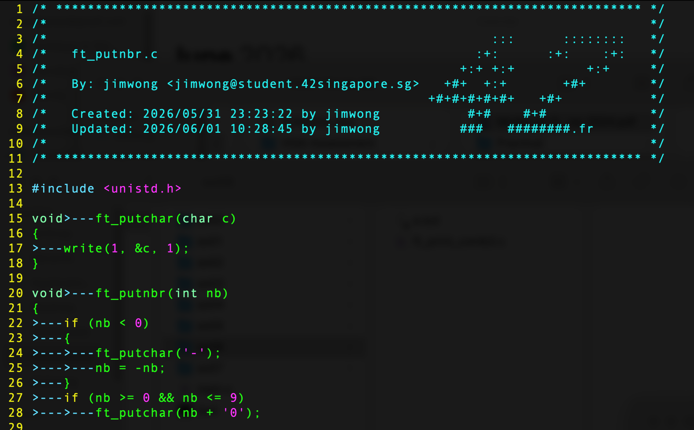

# vim42

A clean, isolated Vim setup for 42 School projects.

`vim42` gives you a separate Vim environment for 42 work, including:

- 42 header support
- Norminette-friendly tab settings
- visible tabs and trailing spaces
- local-only 42 username and email configuration
- no pollution of your normal Vim setup

Normal Vim:

```bash
vim main.c
```

42 Vim:

```bash
vim42 main.c
```

## Preview

This is how vim42 looks when used with the 42 header and visible tab settings:



The sample shows:

- the 42-style file header
- visible tab indicators
- line numbers
- a Vim setup suited for 42 Piscine / 42 School C projects

## What this repo fixes

The usual 42 header setup places `stdheader.vim` inside:

```text
~/.vim/plugin/
```

That means your normal Vim may load the 42 header plugin too.

`vim42` keeps the setup isolated by installing the plugin into:

```text
~/.vim42/plugin/stdheader.vim
```

and launching Vim with:

```bash
vim -Nu ~/.vimrc_42 --noplugin
```

This prevents normal Vim plugins from interfering with `vim42`.

## Attribution

The 42 header functionality and header format are credited to the original 42Paris `42header` project:

```text
https://github.com/42Paris/42header
```

This `vim42` project packages the 42 header into an isolated Vim setup for 42 Piscine / 42 School work.

## Quick Install

Clone the repo:

```bash
git clone https://github.com/jimjwong/vim42.git
cd vim42
```

Run the installer:

```bash
chmod +x scripts/install.sh
./scripts/install.sh yourLogin yourLogin@student.42.fr
```

Example:

```bash
./scripts/install.sh marvin marvin@student.42.fr
```

Refresh your shell:

```bash
source ~/.zshrc
```

Use it:

```bash
vim42 main.c
```

Inside Vim, insert the 42 header with:

```vim
:Stdheader
```

or press `F1`.

## Important

Run the installer with your real 42 login and email:

```bash
./scripts/install.sh your42login your42login@student.42.fr
```

If you skip this or leave `yourLogin`, the header may fall back to the default `marvin@42.fr`.

## What gets installed

The installer creates:

```text
~/.vim42/plugin/stdheader.vim
~/.vimrc_42
```

It also adds this alias to `~/.zshrc` or `~/.bashrc`:

```bash
alias vim42='vim -Nu ~/.vimrc_42 --noplugin'
```

This alias is important because `--noplugin` prevents your normal Vim plugins from loading inside `vim42`.

## Test your setup

Open a fresh test file:

```bash
vim42 test_header.c
```

Inside Vim, run:

```vim
:Vim42Info
```

You should see your configured login and email.

Then run:

```vim
:Stdheader
```

The header should show:

```c
By: your42login <your42login@student.42.fr>
```

## If the header still shows marvin@42.fr

Run:

```bash
cat ~/.vimrc_42 | grep -E "user42|mail42|USER|MAIL"
```

You should see your actual login and email, not `yourLogin`.

Also make sure your alias is this:

```bash
alias vim42='vim -Nu ~/.vimrc_42 --noplugin'
```

Check it:

```bash
alias vim42
```

Then test with a new file:

```bash
rm -f test_header.c
vim42 test_header.c
```

Inside Vim:

```vim
:Vim42Info
:Stdheader
```

## Repository structure

```text
vim42/
├── README.md
├── ATTRIBUTION.md
├── NOTICE
├── LICENSE
├── .gitignore
├── config/
│   └── vimrc_42.example
├── plugin/
│   └── stdheader.vim
├── scripts/
│   ├── install.sh
│   └── uninstall.sh
└── docs/
    └── troubleshooting.md
```
